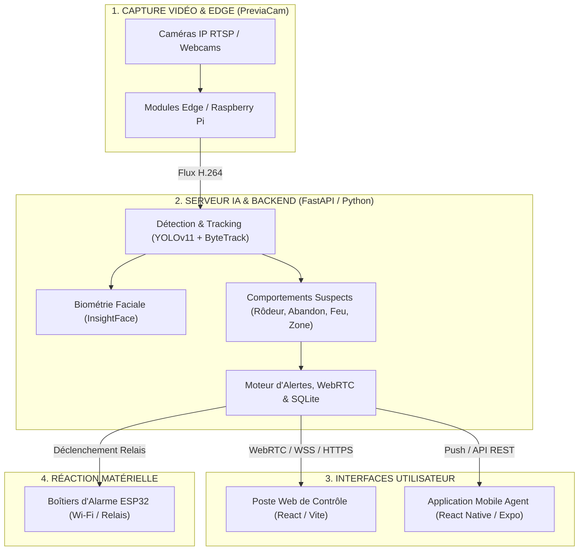

# 📋 CAHIER DES CHARGES GÉNÉRAL (CDCF)
# **PREVIA — OPERATIONS CENTER**
### *Plateforme Intelligente de Vidéosurveillance Proactive et d'Analyse Comportementale par IA*

---

### 📑 FICHE D'IDENTIFICATION DU PROJET
* **Nom du Produit** : **PREVIA** *(Plateforme de Vidéosurveillance Proactive)*
* **Projet & Cadre** : Tech Impact — Orange Summer Challenge 2026 (Orange Digital Center)
* **Période** : 15 Juillet 2026 → 14 Octobre 2026
* **Équipe de Réalisation (Tech Impact)** :
  * 📡 **DRABO Djamilatou** — Ingénierie IoT & Boîtiers physiques ESP32
  * 📢 **KABA Fanta** — Stratégie Communication, Marketing & Branding
  * 🧠 **KONE Aïman** — Modèles IA & Vision par Ordinateur
  * 💻 **NADEMBEGA Romaric** — Architecture Logicielle, Fullstack Web & Backend
* **Encadrement & Formateurs** :
  * **M. Ousmane KIEMDE**
  * **M. Ivan BESSIN**
  * **M. BADO**
* **Version du Document** : 3.0 — Référence Officielle
* **Statut** : Document Validé pour Exploitation & Soutenance

---

## 📌 SOMMAIRE
1. [Contexte, Problématique et Vision](#1-contexte-problématique-et-vision)
2. [Périmètre Global du Système (Scope)](#2-périmètre-global-du-système-scope)
3. [Profils Utilisateurs et Droits d'Accès](#3-profils-utilisateurs-et-droits-daccès)
4. [Architecture Globale de la Solution PREVIA](#4-architecture-globale-de-la-solution-previa)
5. [Spécifications Fonctionnelles Détaillées (SFD)](#5-spécifications-fonctionnelles-détaillées-sfd)
   - [5.1. Plateforme Web (Poste de Contrôle Central)](#51-plateforme-web-poste-de-contrôle-central)
   - [5.2. Application Mobile (Poste Nomade de Terrain)](#52-application-mobile-poste-nomade-de-terrain)
   - [5.3. Cœur d'Intelligence Artificielle & Détections](#53-cœur-dintelligence-artificielle--détections)
   - [5.4. Couche IoT & Réaction Physique (ESP32)](#54-couche-iot--réaction-physique-esp32)
   - [5.5. Système Commercial, Licences & Amorçage](#55-système-commercial-licences--amorçage)
6. [Exigences Non-Fonctionnelles (Performance, Sécurité, Légal)](#6-exigences-non-fonctionnelles)
7. [Matrice MoSCoW & Priorisation](#7-matrice-moscow--priorisation)
8. [Calendrier & Planning de Réalisation (OSC 2026)](#8-calendrier--planning-de-réalisation-osc-2026)
9. [Matrice de Recette et Critères d'Acceptation (DoD)](#9-matrice-de-recette-et-critères-dacceptation-dod)
10. [Glossaire Technique](#10-glossaire-technique)

---

## 1. Contexte, Problématique et Vision

### 1.1. Le Problème de la Vidéosurveillance Traditionnelle
Dans 95% des cas, les caméras de sécurité actuelles sont de simples enregistreurs passifs. Les gardiens humains perdent 80% de leur vigilance après seulement 20 minutes passées devant un mur d'écrans. Les incidents (vols, intrusions, débuts d'incendie) ne sont constatés qu'une fois les dégâts commis.

### 1.2. La Vision PREVIA
**PREVIA** transforme les flux de caméras existants en un système de **sécurité autonome, proactif et préventif** :
* L'IA analyse les flux en continu à la recherche de signaux précurseurs.
* L'alerte est levée en moins de 2 secondes vers les postes fixes (Web) et les agents mobiles (Smartphone).
* La validation reste humaine (*Human-in-the-loop*), mais l'action (sirène, notification) est instantanée.

---

## 2. Périmètre Global du Système (Scope)

```
┌─────────────────────────────────────────────────────────────────────────┐
│                        ÉCOSYSTÈME PREVIA                                │
├────────────────────────────────┬────────────────────────────────────────┤
│           INCLUS (In-Scope)    │            EXCLU (Out-of-Scope)        │
├────────────────────────────────┼────────────────────────────────────────┤
│ • Analyse vidéo temps réel     │ • Stockage des flux sur Cloud public   │
│ • Reconnaissance comportements │   (Traitement 100% Local / On-Premise) │
│ • Face ID (Gestion des accès)  │ • Identification judiciaire de masse   │
│ • Poste Web + Application Mob  │ • Matériel caméra propriétaire imposé  │
│ • Boîtiers IoT relais (ESP32)  │ • Remplacement pompiers certifié ERP   │
│ • Gestion des licences 1 an    │ • Alerte sur supposition sans preuve   │
└────────────────────────────────┴────────────────────────────────────────┘
```

---

## 3. Profils Utilisateurs et Droits d'Accès

| Profil Utilisateur | Rôle Métier | Périmètre d'action |
| :--- | :--- | :--- |
| **Superadministrateur** | Éditeur PREVIA (Previa-SV) | Génération des codes d'amorçage, activation des licences annuelles, supervision globale. |
| **Administrateur Principal** | Responsable Sécurité Client | Gestion des bâtiments, caméras, comptes, enrôlement Face ID, tracé des zones, rapports. |
| **Administrateur Système** | Responsable IT / Réseau | Paramétrage RTSP, chiffrement TLS/WSS, appairage des boîtiers d'alarme ESP32. |
| **Opérateur / Agent** | Gardien / Rondier de sécurité | Visualisation live, traitement des alertes, levée de doute, validation terrain. |

---

## 4. Architecture Globale de la Solution PREVIA



---

## 5. Spécifications Fonctionnelles Détaillées (SFD)

### 5.1. Plateforme Web (Poste de Contrôle Central)
* **SF-WEB-01 (Tableau de Bord)** : Affichage de 4 KPIs dynamiques (*Caméras actives*, *Personnes*, *Alertes*, *Disponibilité*), mosaïque vidéo `LIVE` WebRTC et cartes d'alertes IA.
* **SF-WEB-02 (Inspection Vidéo HD)** : Modale haute définition avec prise de photo instantanée, test webcam locale et fermeture accessible clavier (`Échap`).
* **SF-WEB-03 (Dessin de Zones Polygonales)** : Canvas interactif pour tracer des zones interdites sur l'image d'une caméra avec détection d'intrusion immédiate.
* **SF-WEB-04 (Personnel & Face ID)** : Annuaire des employés, formulaire d'enrôlement par photo et journal des passages avec statut (Autorisé / Inconnu).
* **SF-WEB-05 (Objets & Colis)** : Inventaire en direct des objets suivis (*Track ID*).
* **SF-WEB-06 (Centre de Traitement des Alertes)** : Fiche de levée de doute avec photo de capture, recommandation IA et bouton d'acquittement *« Marquer comme Vérifié »*.
* **SF-WEB-07 (Reporting Officiel)** : Génération et téléchargement à la volée de **rapports PDF officiels** structurés et d'exports de données **CSV/Excel**.
* **SF-WEB-08 (Organisation & Comptes)** : Arborescence *Sites ➔ Bâtiments ➔ Pièces ➔ Caméras* et gestion des utilisateurs.

### 5.2. Application Mobile (Poste Nomade de Terrain)
* **SF-MOB-01 (Alertes Push & Sonores)** : Réception instantanée d'une notification critique avec la photo de l'anomalie dès confirmation par l'IA.
* **SF-MOB-02 (Flux Direct Nomade)** : Visualisation du flux vidéo de la caméra concernée sur smartphone pendant les rondes.
* **SF-MOB-03 (Validation au Pouce)** : Acquittement ou rejet de l'alerte directement sur le terrain.

### 5.3. Cœur d'Intelligence Artificielle & Détections
* **SF-IA-01 (Détection de Rôdage)** : Calcul du temps passé par une personne dans une zone sans mouvement justifié ([rodeur.py](file:///c:/Users/alyak/OneDrive/Desktop/ODC/Previa/tech-impact/migration/backend/fonctionnalites/ComportementsSupects/rodeur.py)).
* **REQ-CAM-04 (Seuil d'immobilité & rôdage paramétrable par zone/caméra)** : Le seuil d'immobilité/rôdage est paramétrable par zone ou caméra (valeur par défaut : 60 secondes). Les postures assises normales ou arrêts courts ne déclenchent pas d'alerte.
* **REQ-CAM-05 (Absence de suspicion systématique sur non-reconnaissance Face ID)** : La non-reconnaissance biométrique Face ID (ex: visiteur, livreur, nouvel employé) attribue un statut neutre Visiteur/Non identifié (🟢/🔵). La suspicion (🔴) est exclusivement déclenchée par des anomalies comportementales avérées (intrusion en zone sensible, rôdage prolongé confirmé).
* **SF-IA-04 (Franchissement de Zone)** : Détection d'intrusion instantanée sur polygone tracé ([detectionEnZone.py](file:///c:/Users/alyak/OneDrive/Desktop/ODC/Previa/tech-impact/migration/backend/fonctionnalites/zoneCam/detectionEnZone.py)).

### 5.4. Couche IoT & Réaction Physique (ESP32)
* **SF-IOT-01 (Découverte mDNS)** : Détection automatique des boîtiers d'alarme ESP32 connectés sur le réseau local.
* **SF-IOT-02 (Pilotage Relais)** : Déclenchement automatique ou manuel des sirènes sonores et gyrophares lumineux en cas d'urgence.

### 5.5. Système Commercial, Licences & Amorçage
* **SF-LIC-01 (Amorçage Initial)** : Activation du serveur via un code secret d'amorçage unique vérifié en ligne.
* **SF-LIC-02 (Durée de Licence 1 An)** : Décompte automatique des 365 jours d'exploitation.
* **SF-LIC-03 (Verrouillage à l'expiration)** : Blocage total de l'interface avec invitation de renouvellement en cas de fin de contrat ([licence.py](file:///c:/Users/alyak/OneDrive/Desktop/ODC/Previa/tech-impact/migration/backend/fonctionnalites/Infrastructure/licence.py)).

### 5.6. Feuille de Route & Exigences Architecturales (Les 6 Piliers Stratégiques)

#### 🎯 1. Fiabilité de la Détection & Qualification des Alertes
* **REQ-DET-01 (Spécification de l'Infiltration)** : Définition formelle de l'infiltration par coïncidence de zone intérieure, absence d'enrôlement biométrique/badge et fenêtre d'apparition non couverte par une entrée.
* **REQ-DET-02 (Validation Multi-Frames)** : Confirmation obligatoire d'une anomalie sur au moins 3 trames consécutives avant déclenchement d'alerte pour éliminer les flashs de faux positifs.
* **REQ-DET-03 (Suivi des Faux Positifs & Calibrage)** : Marquage et enregistrement des réjections d'alerte par caméra/zone permettant d'ajuster dynamiquement les seuils de sensibilité.
* **REQ-DET-04 (Preuve Vidéo MP4 Extrait 10s)** : Génération automatique et association d'un clip vidéo de 10s (5s avant / 5s après) à la fiche d'alerte pour une levée de doute rapide.

#### 🔐 2. Sécurité Informatique, Biométrie & Conformité RGPD / CIL
* **REQ-SEC-01 (Authentification Renforcée 2FA)** : Support du second facteur d'authentification (TOTP / OTP) obligatoire pour les comptes d'administration.
* **REQ-SEC-02 (Chiffrement Biométrique au Repos & Rétention CIL)** : Chiffrement AES-256 des empreintes faciales stockées en base et tenue d'un registre CIL précisant la durée de conservation de chaque donnée.
* **REQ-SEC-03 (Journal d'Audit Inviolable)** : Journalisation immuable et infalsifiable de toutes les actions d'administration et d'exploitation.
* **REQ-SEC-04 (Signalétique & Mentions Légales)** : Intégration et affichage des mentions légales réglementaires de vidéosurveillance sur le portail et les accès.

#### ⚡ 3. Résilience, Alimentation & Santé du Parc
* **REQ-RES-01 (Spécification Alimentation Secourue UPS)** : Exigence d'interfaçage et de support d'une alimentation sans interruption (Onduleur / UPS) pour la continuité de service.
* **REQ-RES-02 (Détection de Masquage & Coupure Caméra)** : Alerte instantanée en cas de sabotage optique, masquage de lentille ou déconnexion réseau d'une caméra (> 15s sans image).
* **REQ-RES-03 (Monitoring de Santé Multi-sites)** : Tableau de bord de santé technique pour le Superadministrateur (charge processeur, état des flux RTSP, disponibilité des relais IoT).

#### 📊 4. Exploitation Quotidienne & Consignes Opérateur
* **REQ-OPS-01 (Tableau de Bord Statistique & KPIs)** : Analyse des tendances d'alertes par créneau horaire, taux d'acquittement et temps moyen de réponse des opérateurs.
* **REQ-OPS-02 (Playbooks de Consignes Personnalisables)** : Fiches de consignes d'intervention configurables par type d'anomalie pour guider l'opérateur sur le terrain.

#### 🏗️ 5. Scalabilité, API Ouverte & Interconnexion
* **REQ-ARCH-01 (API Ouverte & Webhooks)** : Exposition d'APIs REST et de Webhooks sécurisés pour l'intégration avec des systèmes tiers (contrôle d'accès physique par badgeuse, SIEM).
* **REQ-ARCH-02 (Équilibrage de Charge GPU / Multi-Nodes)** : Architecture distribuée permettant de répartir l'inférence vidéo sur plusieurs processeurs graphiques pour les installations d'envergure.

#### 📚 6. Documentation & Adoptaion Opérationnelle
* **REQ-DOC-01 (Guide Opérateur & Kit de Formation)** : Support de formation illustré et manuel d'exploitation pour faciliter l'adoption par les agents de sécurité.

---

## 6. Exigences Non-Fonctionnelles

* **Performance & Latence** : Flux WebRTC en direct avec une latence < 500 ms ; temps de détection et d'alerte global < 2 secondes.
* **Ergonomie (UI/UX)** : Charte graphique *Previa Sapphire*, typographies lisibles (`Inter`, `JetBrains Mono`), conformité WCAG AA (contrastes élevés, navigation clavier).
* **Souveraineté & RGPD / CIL** : Traitement 100% On-Premise, flux vidéo chiffrés (HTTPS/TLS), purge automatique des captures selon la politique de rétention légale.
* **Résilience** : Reprise automatique de service sans intervention manuelle après une coupure d'alimentation ou de réseau.

---

## 7. Matrice MoSCoW & Priorisation

| Priorité | Périmètre Fonctionnel PREVIA |
| :--- | :--- |
| **Must have (Indispensable)** | • Analyse vidéo temps réel multi-caméras.<br>• Détections : Rôdage, Intrusion en zone interdite.<br>• Face ID pour autorisations de présence.<br>• Traitement 100% local (zéro cloud tiers).<br>• Gestion des licences d'amorçage. |
| **Should have (Important)** | • Tableau de bord KPIs avec accès direct.<br>• Tracé interactif de zones polygonales.<br>• Journal d'audit et export PDF officiel. |
| **Could have (Optionnel)** | • Application mobile dédiée agents de terrain.<br>• Assistant de synthèse vocale pour état du bâtiment. |
| **Won't have (Exclu)** | • Identification de personnes à des fins judiciaires.<br>• Action automatique critique sans validation humaine préalable. |
| **Should have (Important)** | • Tableau de bord KPIs avec accès direct.<br>• Tracé interactif de zones polygonales.<br>• Journal d'audit et export PDF officiel. |
| **Could have (Optionnel)** | • Application mobile dédiée agents de terrain.<br>• Assistant de synthèse vocale pour état du bâtiment. |
| **Won't have (Exclu)** | • Identification de personnes à des fins judiciaires.<br>• Action automatique critique sans validation humaine préalable. |

---

## 8. Calendrier & Planning de Réalisation (OSC 2026)

```
15/07 ────────────────────────────── 29/08 ────────────── 16/09 ────────── 14/10
  │                                    │                    │                │
  ▼                                    ▼                    ▼                ▼
[ Phase A : Cadrage ]        [ Phase B : Dév & IA ]   [ Tests & Calib ]  [ Phase C : Marketing & Pitch ]
(Attribution, Rôles)         (Web, Mobile, IA, IoT)   (Validation DoD)   (Branding, Démo finale)
```

* **15/07 - 16/07** : Cadrage, attribution et répartition des rôles (Phase A).
* **16/07 - 29/08** : Conception, développement de la maquette, du backend IA et de l'IoT (Phase B).
* **30/08 - 16/09** : Campagne de tests fonctionnels, calibrage des modèles et rédaction documentaire.
* **17/09 - 14/10** : Stratégie marketing, communication, branding et répétition du Pitch final (Phase C).

---

## 9. Matrice de Recette et Critères d'Acceptation (DoD)

| Réf. Test | Scénario de Test | Critère d'Acceptation (Definition of Done) |
| :---: | :--- | :--- |
| **TEST-01** | Connexion utilisateur | Accès sécurisé au tableau de bord avec session persistante. |
| **TEST-02** | Validation de licence | Le code secret d'amorçage débloque la plateforme pour 1 an. |
| **TEST-03** | Mosaïque vidéo direct | Les flux WebRTC s'affichent avec pastille `LIVE` fluide. |
| **TEST-04** | Tracé de zone interdite | Le polygone est sauvegardé et conservé en base locale. |
| **TEST-05** | Intrusion en zone | Alerte critique levée en < 2s avec photo de capture. |
| **TEST-06** | Objet abandonné | Alerte levée si un sac est isolé pendant plus de 2 minutes. |
| **TEST-07** | Reconnaissance Face ID | L'employé enrôlé est identifié et affiché avec son nom. |
| **TEST-08** | Déclenchement IoT | Le boîtier ESP32 déclenche la sirène lors d'une alerte critique. |
| **TEST-09** | Acquittement opérateur | Le clic sur *« Marquer comme Vérifié »* clôture l'alerte. |
| **TEST-10** | Rapport PDF | Téléchargement immédiat d'un rapport PDF officiel complet. |

---

## 10. Glossaire Technique

* **WebRTC** : Protocole standard de streaming audio/vidéo direct à très basse latence (< 500 ms) dans le navigateur.
* **RTSP** (*Real Time Streaming Protocol*) : Protocole de transmission vidéo utilisé par les caméras IP.
* **Track ID** : Identifiant numérique unique attribué par le modèle de vision à une cible suivie dans l'image.
* **Face ID** : Système de reconnaissance faciale biométrique calculant des vecteurs d'empreinte faciale.
* **ESP32** : Microcontrôleur Wi-Fi pilotant les relais physiques d'alarme (sirènes, gyrophares).
* **Human-in-the-loop** : Principe imposant une validation humaine avant toute décision critique de sécurité.
* **DoD** (*Definition of Done*) : Critères formels indispensables pour valider la fin d'un développement.

---
*Fin du document de référence — PREVIA (Tech Impact - OSC 2026)*
