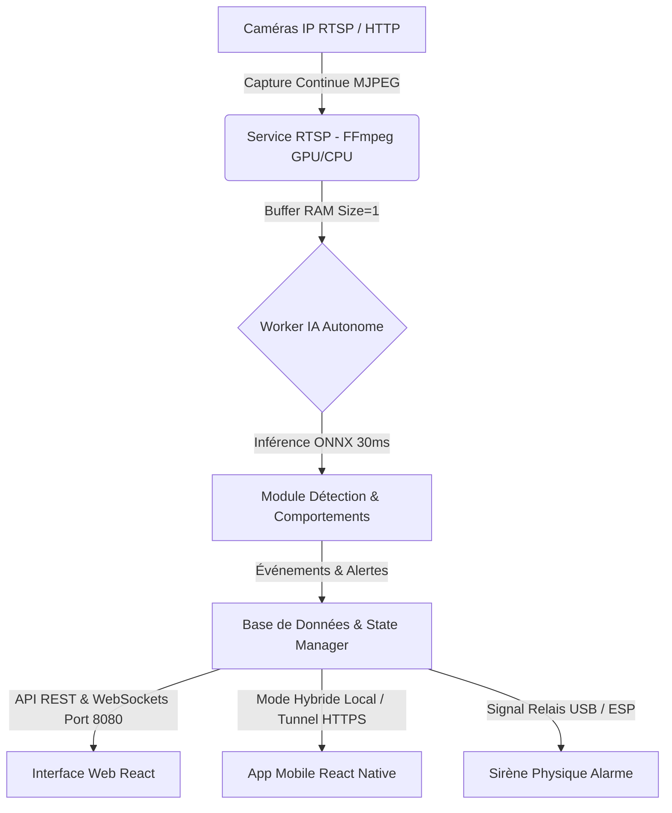

# 🛡️ PREVIA - Système Intelligent de Surveillance & Alerte Précoce par IA

[](#architecture--technologies)
[](https://fastapi.tiangolo.com/)
[](https://vitejs.dev/)
[](https://expo.dev/)
[](https://www.raspberrypi.com/)

**PREVIA** est une plateforme autonome de vidéosurveillance intelligente et d'analyse comportementale par IA. Elle transforme les caméras IP existantes en un dispositif de prévention active : détection en temps réel d'intrusions en zone interdite, de rôdages suspects et reconnaissance faciale biométrique (Face ID) avec notifications mobiles et sirène physique d'urgence.

---

## 🌟 Fonctionnalités Principales

- 🧠 **Détection IA Multi-Modèles & Accélération ONNX** :
  - **Détection & Suivi d'objets** (`YOLOv8n` / `YOLO11n-seg` au format ONNX via OpenCV DNN).
  - **Identification des personnes** (ReID d'apparence, genre, pose et caractéristiques vestimentaires).
  - **Détection comportementale** : Rôdage prolongé en zone sensible, intrusions et accès non autorisés.
- ⚡ **Stream Vidéo Zéro-Latence & Capture Découplée** :
  - Capture continue RTSP / HTTP universelle alimentant un buffer de taille 1 en mémoire vive (RAM).
  - Worker IA autonome découplé à cadence optimale pour ne jamais ralentir le flux vidéo direct.
  - Décodage matériel GPU (`h264_v4l2m2m`) avec repli logiciel automatique à chaud.
- 📱 **Application Mobile (React Native / Expo)** :
  - **Mode Hybride Automatique** : Basculement transparent entre le réseau Wi-Fi local et le tunnel sécurisé HTTPS sur réseau cellulaire (4G/5G).
  - Alertes push en direct avec clips de preuve de 10 secondes.
  - Contrôle à distance de l'alarme et désactivation d'urgence.
- 🖥️ **Tableau de Bord Web (React + Vite)** :
  - Vue multi-caméras interactive avec overlays de détection en temps réel.
  - Gestion des bâtiments, des caméras IP et des permissions administrateurs/opérateurs.
- 🚨 **Réponse & Preuves d'Incident** :
  - Signalisation visuelle et sonore d'urgence sur le dashboard Web & l'application mobile.
  - Enregistrement automatique de clips vidéo de preuve d'incident (`.mp4` de 10s).

---

## 🏗️ Architecture & Technologies



### Stack Technique :
- **Backend Core** : Python 3.11+, FastAPI, Uvicorn, OpenCV DNN, ONNX Runtime, Ultralytics YOLO.
- **Frontend Web** : React 18, Vite, Lucide Icons, CSS3 Glassmorphism.
- **App Mobile** : React Native, Expo SDK, AsyncStorage, API Client Hybride.
- **Edge Deployment** : Raspberry Pi OS (Linux 64-bit), Systemd, Docker, FFmpeg V4L2 M2M.

---

## 🚀 Lancement Rapide (Scripts 1-Clic)

Le projet intègre des lanceurs automatiques adaptés à chaque environnement :

### 1. Backend Local (PC Windows / Linux)
Double-cliquez sur **`LANCER_BACKEND_LOCAL.bat`** ou exécutez :
```bash
python -m uvicorn migration.backend.fonctionnalites.main.main:app --host 0.0.0.0 --port 8080
```
L'API et la console de gestion seront accessibles sur `http://localhost:8080`.

### 2. Application Mobile (Expo Metro)
Double-cliquez sur **`LANCER_MOBILE.bat`**. Le script libère automatiquement le port 8081, vérifie que le backend tourne et démarre Metro Bundler.

### 3. Déploiement sur Raspberry Pi 4 / 5
Double-cliquez sur **`LANCER_SUR_RASPBERRY.bat`** pour scanner automatiquement le réseau local, synchroniser les sources et lancer le serveur sur le Raspberry Pi.

---

## 🛠️ Installation Manuelle sur Raspberry Pi 4

1. Clonez ce dépôt sur votre ordinateur ou votre Raspberry Pi :
   ```bash
   git clone https://github.com/Alya351/Previa.git
   cd Previa
   ```

2. Exécutez le script d'installation système automatisé :
   ```bash
   chmod +x installer_pi4.sh
   ./installer_pi4.sh
   ```

3. Lancez le service PREVIA :
   ```bash
   python3 lancer_previa.py
   ```

---

## 📄 Structure du Projet

```text
├── migration/
│   ├── backend/                 # API FastAPI, IA, Services Caméras & Alerte
│   │   └── fonctionnalites/
│   │       ├── DetectionPrincipal/  # Inférence ONNX / YOLO (on_voit_quoi, on_voit_qui)
│   │       ├── ComportementsSupects/ # Algorithmes Rôdeur, Abandon, Infiltré, Feu
│   │       ├── cam/                 # Gestionnaire de caméras IP & Service RTSP FFmpeg
│   │       └── Infrastructure/      # Base de données locale, clips & sirène
│   ├── frontend/
│   │   ├── web/                 # Tableau de bord React + Vite
│   │   └── mobile/              # Application mobile React Native / Expo
│   └── models/                  # Poids des modèles IA (yolov8n.onnx, yolo11n-seg.pt)
├── LANCER_BACKEND_LOCAL.bat    # Lanceur 1-clic Backend Local
├── LANCER_MOBILE.bat           # Lanceur 1-clic Application Mobile
├── LANCER_SUR_RASPBERRY.bat     # Lanceur 1-clic Déploiement Raspberry Pi
├── installer_pi4.sh            # Script d'installation automatique Linux/Pi
└── CAHIER_DES_CHARGES.md       # Spécifications fonctionnelles et techniques
```

---

## 🔒 Sécurité & Confidentialité

- **Données 100% Souveraines** : Aucun flux vidéo n'est transmis vers un cloud tiers. Toute l'analyse IA s'effectue en local (Edge Computing).
- **Sécurité des Sirènes** : Temporisation physique matérielle à 120s max pour éviter toute pollution sonore en cas d'absence.
- **Mode Hors-Ligne** : Fonctionnement garanti même en cas de coupure de la connexion Internet externe.

---

## 📝 Licence & Auteurs

Développé dans le cadre du projet **PREVIA** par l'équipe Tech Impact.
Tous droits réservés.
